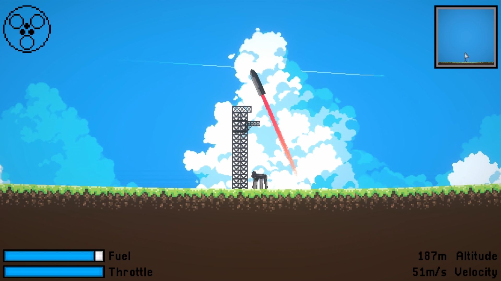

# Tower Catch

Tower Catch is a game about landing SpaceX Starships

## How to Play

1. Use the left and right arrow keys to steer and glide towards the tower
2. Press space to ignite your engines and use the left and right arrow keys to flip
3. Use the up and down arrow keys to control the throttle and land smoothly on the tower arms
4. Press space to shutdown your engines

Example: https://youtu.be/65u_Rm_Ivh8

> NOTE: Tower Catch is in development and an actual tutorial will come out Soon™

## Play Now

https://towercatch.netlify.app

---

Made with ❤️ for Moonshot thanks to Hack Club

  

